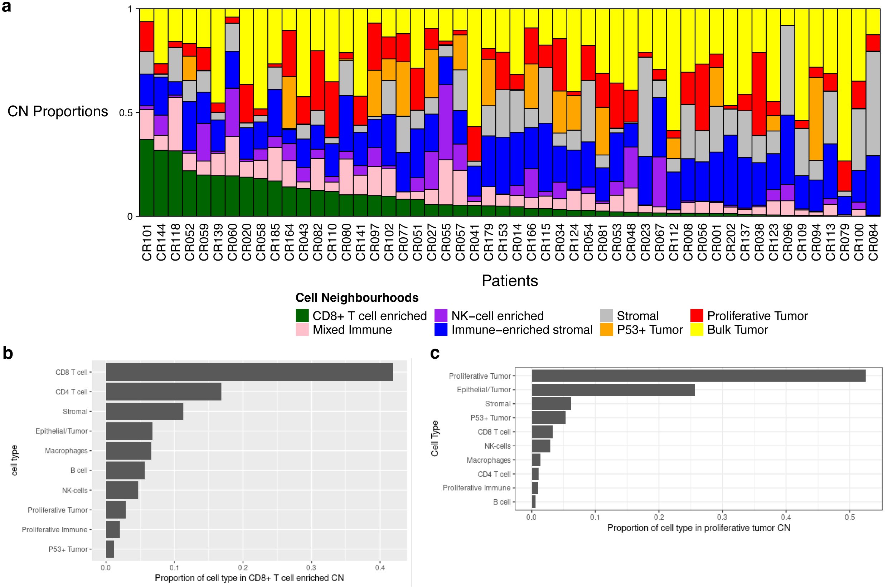
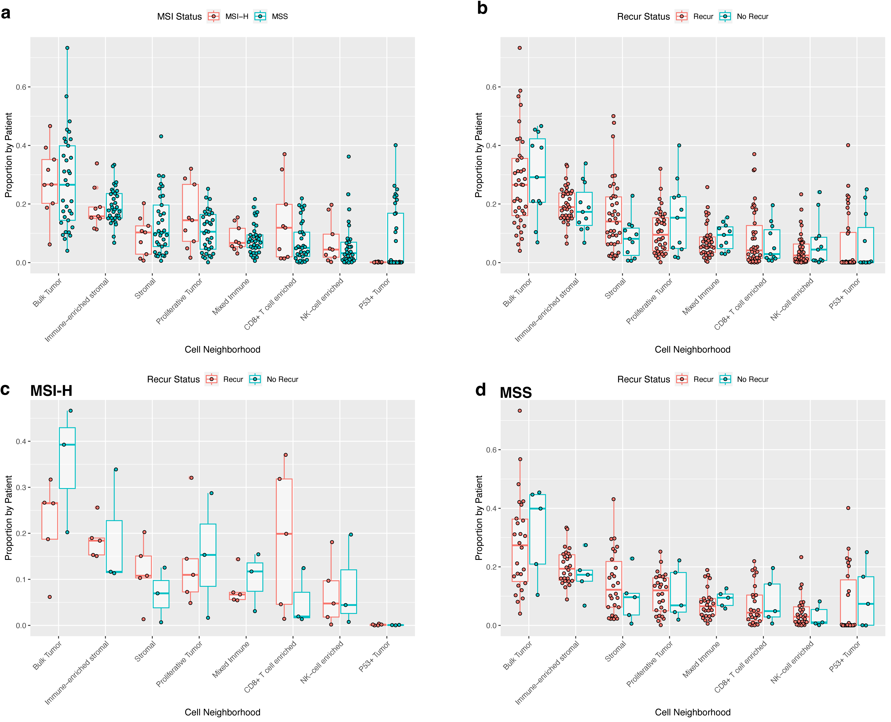
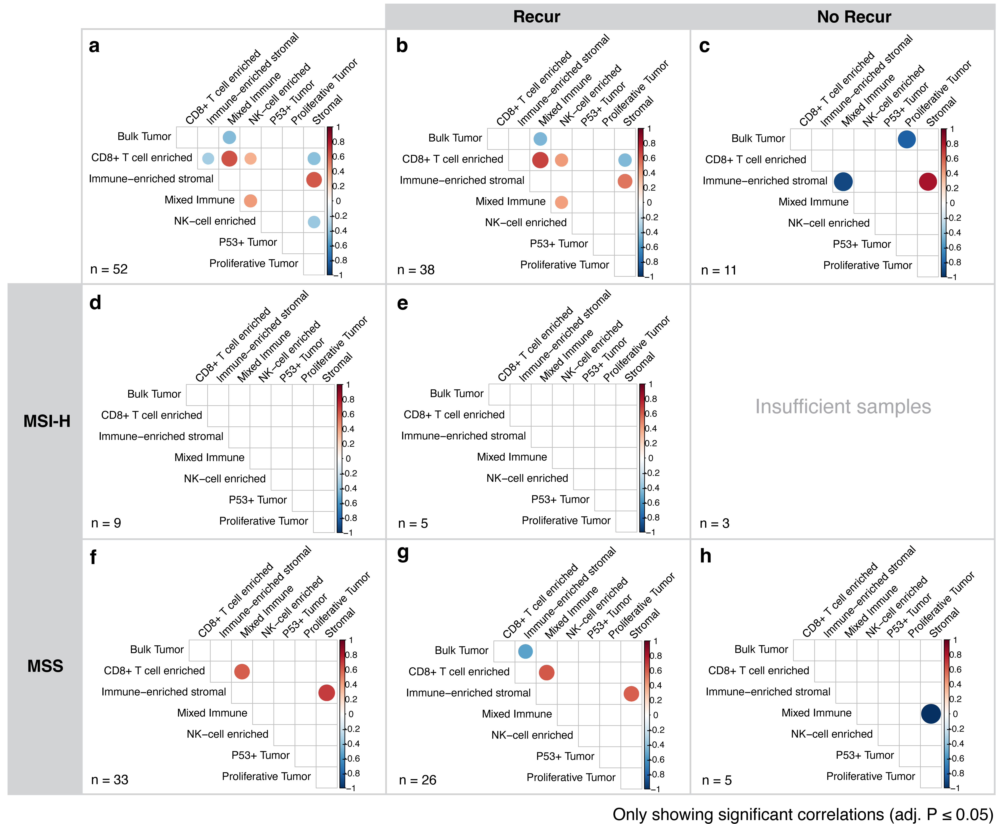

# Cell Neighbourhoods (CNs)

# Supplementary Figure 13
`CN_proportion_by_patient_stacked_barplot_cancer.R` generates the stacked barplot in panel A. 

# Supplementary Figure 14

`CN_proportion_by_patient_comparisons.R` generates these boxplots. 

# Supplementary Figure 15

`Figure_5/CN_proportion_by_patient_correlations` generates these correlation plots.

