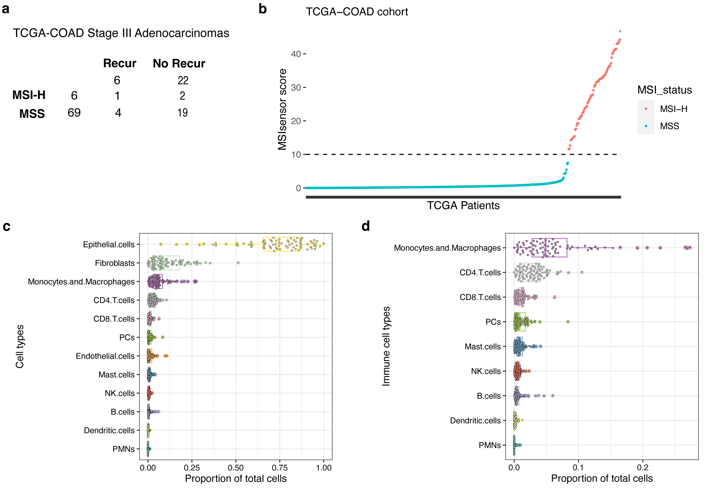

# External validation on TCGA colon adenocarcinoma data

## Data

`CIBERSORTx_Results.txt` is CIBERSORTx deconvoluted cell type proportions for 33 cancer types  
`Clinical_metadata.xlsx` includes cancer type and staging for the samples  
`MSI_cBioPortal.tsv` contains [MSIsensor](10.1093/bioinformatics/btt755) scores used to determine MSI status

## Analysis

`01_TCGA_data_preprocessing.R` merges the data files and subsets them to only stage III colon adenocarcinomas, the same cancer stage and type used in the Hyperion data.
- We selected all stage III colon adenocarcinomas including stage IIIA, IIIB and IIIC
- We used the [TCGA sample codes](https://gdc.cancer.gov/resources-tcga-users/tcga-code-tables/sample-type-codes) to identify and exclude tumor-adjacent normal samples
- Determined MSI status from MSIsensor score and exported supplementary figure 4b
- Plotted stage III colon adenocarcinoma cell type proportions for Supplementary Figure 4c,d
- Exported table of cell type proportions for stage III colon adenocarcinomas: `TCGA_COAD_Stage_III_CIBERSORTx.csv`

## Results
### Supplementary Figure 4
