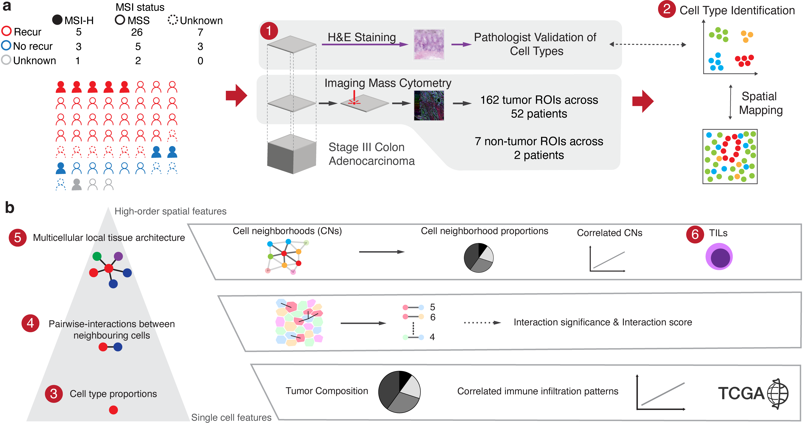

  

# The cellular spatial landscape of Stage III colorectal cancers
## Abstract
We conducted a spatial analysis of stage III colorectal adenocarcinomas using Hyperion Imaging Mass Cytometry, examining 52 tumors to assess the tumor microenvironment at the single-cell level. This approach identified 10 distinct cell phenotypes in the tumor microenvironment, including stromal and immune cells, with a subset showing a proliferative phenotype. By focusing on spatial neighborhood interactions and tissue niches, particularly regions with tumor-infiltrating lymphocytes, we investigated how cellular organization relates to clinicopathological and molecular features such as microsatellite instability (MSI) and recurrence. We determined that microsatellite stable (MSS) colorectal cancers had an increased risk of recurrence if they had the following features: 1) a low level of stromal tumor-infiltrating lymphocytes, and 2) low interactions between CD4+ T cells and stromal cells.  Our results point to the utility of spatial single-cell interaction analysis in defining novel features of the tumor immune microenvironments and providing useful clinical cell-related spatial biomarkers.

## Install

Our code is mostly shared as R scipts, primarily developed with the 4.1.0 release. The exception are scripts for comparing proportions of cells which uses the [speckle](https://github.com/phipsonlab/speckle) package and requires a newer version of R - we used R 4.2.3. 

## Data availability
The Seurat and Scanpy objects for single-cell data, along with a CSV file containing coordinates and cell types for all single cells, have been deposited in Zenodo under the DOI: https://doi.org/ 10.5281/zenodo.13901180.  The original IMC image data and the image of tissue regions with pathologist annotations has also been uploaded to Zenodo under the same DOI. All H&E images can be downloaded from [!https://dna-discovery.stanford.edu/publicmaterial/datasets/spatial_CRC/].  All these files are publicly accessible as of the publication date.

